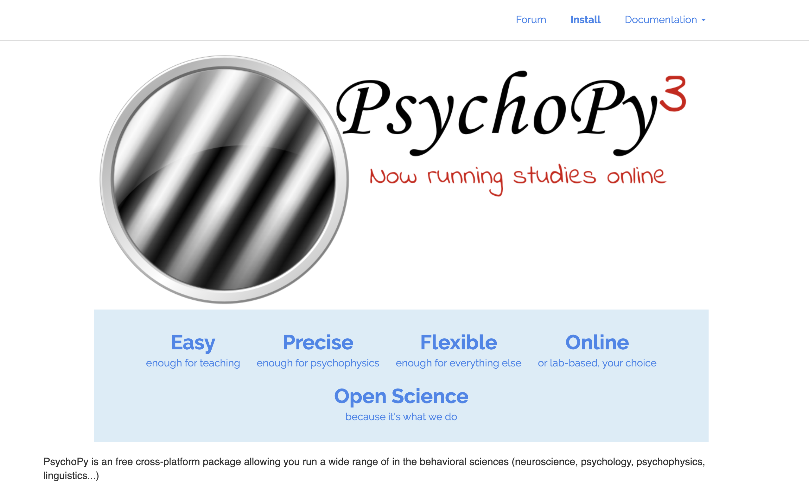
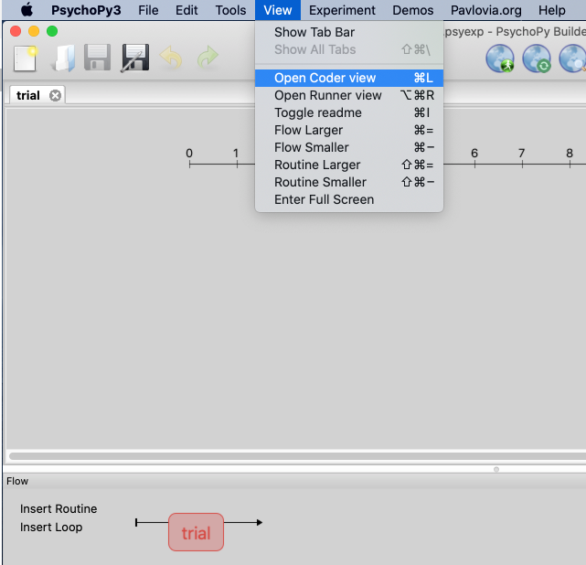
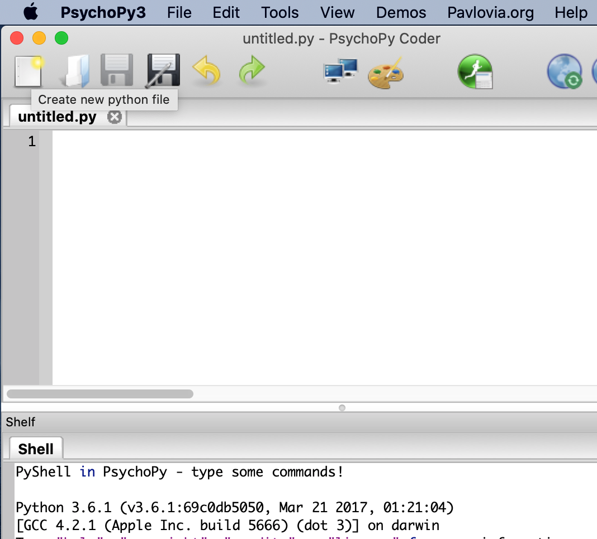
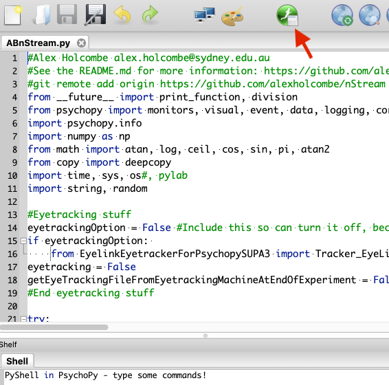
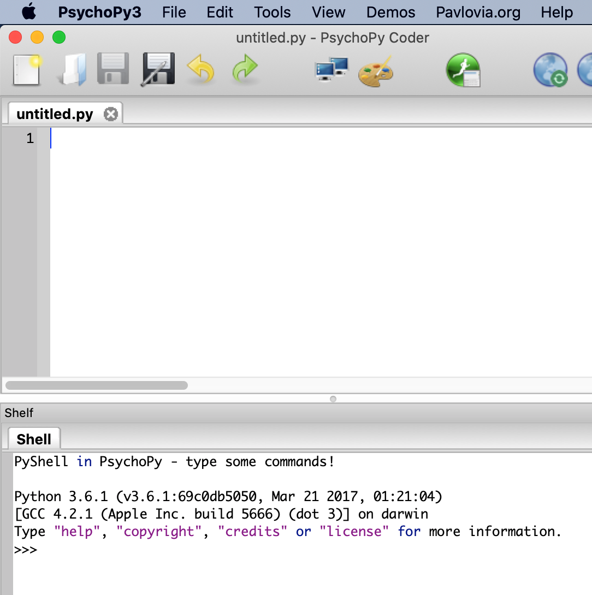

# PsychoPy Coder入門
### 専修大学人間科学部　国里愛彦

## はじめに
本資料は、専修大学人間科学部の国里ゼミで使用するPsychoPyに関するトレーニング資料になります。
本資料は、まだ完成版には程遠く、間違いも存在する可能性があります。もし誤りなどがございましたら、
[メールフォーム](https://docs.google.com/forms/d/1OQ7pN-oQda1YwGvcTBga3oKkviI697uc9AQlGVhX2YI/viewform)にて
ご連絡いただけましたら幸いです。

## 課題0
### 課題0の1
*「PsychoPyのダウンロードとインストールをしよう！」*

PsychoPyのサイト(http://www.psychopy.org/) からダウンロード&
インストールしましょう。
大体インストールさいれたものをダブルクリックとかすればインスール開始される。
細かい設定とかもあるけど、気にしない。



### 課題0の2
*「PsychoPyのCoder画面を開こう！」*

PsychoPyはGUIでも実験課題を作ることができる(Builderと呼ぶ)。
最初は、Builderの方が簡単なので良いかなと思うかもしれないですが、
複雑な実験課題を作る時にCoderでないと難しい時がある。
Coderは、プログラミングになる。プログラミングは、将来それを仕事に
しない人も一度勉強しておくとよい。パソコンのスキルが上がるし、
複雑な作業をできるだけ単純にして、効率的に処理することができるようになる。

「Coderだったら、この面白そうな実験課題が使えるのに...でもプログラミングは
勉強してないから、別のやつにしよう」となってはツマラナイ。
やりたい研究を自由にできるように勉強したい。



左端のアイコンを選ぶと新しいエディタがでてきます。このエディタ部分にコードを書き込んでいきます。



コードがかけたら、緑色のアイコン（赤い矢印で指している）をクリックするとコードが実行できます。
実行すると、下のOutput(出力)タブにその結果がでます。shell（シェル）では、Pythonコードを
確認することができます（このコードはどういう動きをするのか確認したい時に便利です）。



### 課題0の3
*「Shellでプログラミング入門をしよう！」*

なぜかわからないけど、プログラミグの最初の一歩では、”Hello World”って画面に
表示させることが多い。「シェル」タブにコードを打ち込んで”Hello, Python!”と画面に表示させてみよう！



「シェル」タブに以下のコードを打ち込もう。
```python
a = “Hello, Pyton!”
print a
```
“＝”は数学での意味とは違って、左辺に右辺のものを代入するという意味です。
つまり、“Hello, Pyton!”という言葉をaに入れます（格納なんて言ったりする）。
そして、その“Hello, Pyton!”が入ったaを出すにはprintという命令をつかいます。


## 課題１
*「灰色の画面上に黒字で”Hello, Python!”と３秒間表示させよう！」*

パソコンに強い人はPsychoPyとかでネット検索してやると力がつくと思いますが、
以下のヒントも活用ください。模範解答(task1.py)もありますが、まずはヒントをみつつ、
自分で作成しましょう。

**ヒント** coderのエディタを新規作成して、以下を打ち込みます
（コーディングをUTF-8に指定する。PsychoPyを日本語で使う場合に必要）。
```python
# -*- coding: utf-8 -*-
```

**ヒント** 以下のように、PsychoPyから必要なモジュールをインポートする
（実験によって、インポートする内容は変わる）。PsychoPy以外にも
Pythonで必要なモジュールをインポートする(numpy, os , random, time, csv)。

```python
from psychopy import visual, core, event, gui, data, misc
import numpy, os , random,time,csv
```

**ヒント** プログラミングをするとかならずエラーが生じます。
エラーがあったら、以降の処理をストップして、エラーを報告してくれる方法として、
try-except文があります。これをつかうと、try以降のプログラム（以下では”なんらかの処理”）
にエラーが生じるとその内容を表示してくれます。

```python
try :
	なんらかの処理
except TypeError, e:
	print e
```

**ヒント** 多くのプログラミング言語では、()とか{}を使って、処理の単位を区分します。
Pythonでは、処理の単位をインデント(Tabや半角スペース４つ)で区分します。
以下のように処理の単位のブロック１とブロック２をインデントで分けています。

```
ブロック1の始まり:
  ブロック1
    ネストしたブロック2:
      ここはブロック2
      ここもブロック2
  ブロック1に戻って来た
ブロックの外
```

**ヒント** PsychoPyで視覚刺激提示は、visual.Windowで画面の準備をして、何かに格納する（myWinがよくつかわれる）。
文字刺激の場合は、visual.TextStimで刺激を準備して、何かに格納する（以下の例では、myText）。
そして、draw()で準備した刺激を書き込んで、書き込んだ画面(以下の例ではmyWin)をflip()で提示する。core.wait(秒)で何秒間画面を出すか指定する。

```
myWin = visual.Window(fullscr=True, monitor= 'Default', allowGUI=False, units='norm', color= (0,0,0))
myText = visual.TextStim(myWin,text = u‘ここに表示したい刺激を書く',color = (-1,-1,1))
myText.draw()
myWin.flip()
core.wait(2)
```

**ヒント** 上記のmyWinやmyTextは、こちらで好きに名前を決めてよいものになります。
こういった変数の名前をつける場合は、分かりやすい名前をつけることが大切です。
分かりやすい名前をつけるとなると複合語になります。例えば、怒った顔刺激のリストの
場合、angry+face+listでangryFaceListといった名前になります。
このように、複合語の複合語の先頭を、小文字で書き始め、続く語の最初を大文字
で書き表すことをキャメルケースと呼びます（大文字が「らくだのこぶ」のように見えることからこの名前です）。


**ヒント**: PsychoPyでの色表示は、いろいろな方法がとれますが、
RGB(赤緑青の三原色を混ぜる方法)では以下のような、数字で設定をします。

* 白：　color = ( 1,1,1)
* 灰色：color = (0,0,0)
* 黒：　color = (-1,-1,-1)
* 赤：　color = (1.0,-1,-1)
* 緑： color = (-1, 1, -1)
* 青： color = (-1, -1, 1)
* ピンク：　color = (1.0,0.6,0.6) 　

**ヒント** PsychoPyはフリーズすることがあるので、こまめに保存をする。
また、psychoPyのエディタ上では、日本語入力がやりにくい。
そのため、PsychoPy上でコードを修正するよりも、なんらかのテキストエディタで作成や修正をしたほうが早い
（〜.pyという名前のファイルをテキストエディタで開いて編集、PsychoPyで動作確認とすると早いです）。
エディタは、なんでも良いのだけど、[Atom](https://github.com/atom/atom)が色々なOSで使えるし便利です。


## 課題2
*「"1"、"2"、"3"、"4"、"5"の数字を１秒間ずつ画面に提示してみよう！」*

**ヒント**　刺激の準備(visual.TextStim)からcore.wait(1)を繰り返します。

**ヒント**　#を使うとその部分は実行されません。プログラミングでは、
かならず#などを使って、自分が行っている処理について説明を加えてください。

## 課題３
*「"あ"、"い"、"う"、"え"、"お"を１秒間ずつ画面に提示してみよう！」*

**ヒント**  日本語の場合は、TextStimでtext = ‘あ’とするところを、
text = u‘あ’と文字の前にuをいれてみましょう。日本語として処理してくれます。


[](
2016年度の修正ここまで
)

## 課題４
*「"1"、"2"、"3"、"4"、"5"を１秒間ずつ画面に提示することを、５回繰り返してみよう！」*
「１」、「２」、「３」、「４」、「５」、「１」、「２」、「３」、「４」、「５」、
「１」、「２」、「３」、「４」、「５」と刺激の準備(visual.TextStim)から１秒間待つ
(core.wait)を15回繰り返しても良いけど、効率がわるい。単純に繰り返すのではない方法を選びましょう。

**ヒント** 刺激を毎回指定するのではなくて、あらかじめリストを作っておいて、
そのリストから刺激を指定するとスムーズです。リストは以下のように、要素を[]でくくります
（以下の場合は、list1に格納）。
```python
list1 = [1,2,3,4,5]
list2 = [u‘あ’,u‘い’,u‘う’,u‘え’,u‘お’]
```
普通、リスト内の番号は、1から2,3,4…と数える、Pythonでは，0から1,2,3…と数えます。
なので、list1[3]とした時は、３番目の3ではなくて４番目の４になります。list2[2]としたときは、u’い’ではなくu’う’になる。

刺激のリストではなく、単純に0から１ずつ増える数字のリストを作りたい場合は、range()を使うと良い。
range(リストの長さ)とすることで、必要な長さの0から始めるリストを作れる。
以下のようにすると、list3に[0,1,2,3,4,5,6,7]が入る(Pythonなので、1ではなくて0からスタート)。

```python
list3 = range(8)
```

**ヒント** 全く同じことを繰り返すときは、for文を使います。
先ほどのrange(繰り返し数)によって、0から1ずつ繰り返したい数の１つ前まで増えるリストが作れます。
以下のfor文は、range()で作成したリストの最初から順番に変数にいれて繰り返しをして、
range()のリストの最後まできたら、終了します。

```python
for 変数　in　range(繰り返し数) :
	命令（数字を画面に提示するなど）
```

以下を「シェル」に打ち込むと、range(5)に入っている、0から4がiに入って、
画面に表示(print)される。リストが最後までいくと繰り返しは終了する。
```python
for i　in　range(5) :
  print i
```

for文での変数（上記だとi）をうまく使うと色々と便利です。
また、インデントを使って、for文を重ねることができます。
以下の場合は、３回内側のループを回すことを５回繰り返すということになります。
```python
for i in range(5):
  for m in range(3):
  	print m
```

なお、リストは、for文の前で設定をするようにしてください。

## 課題5
*「課題４を応用して、漢字で"壱"、"弐"、"三"、"四"、"五"を１秒ずつ提示することを、
５回繰り返してみよう！」*

##　課題6
*「1から９の数字をランダムにだしてみよう(1から9の数字は0.5秒間ずつ２回提示する)！」*

**ヒント** numpy.random.shuffle(リスト)という関数を使います。
これを使うと，リストの中身がシャッフルされます。

## 課題7
### 課題7の１
*「課題６を使って、1から９の数字をランダムに0.5秒ずつだす（２回繰り返し）時に、
色を変えて提示してみよう！」*

**ヒント** 課題1でも簡単に触れましたが、visual.TextStim内のcolorとcolorSpaceで色を設定できます。

* 白：　color = ( 1,1,1)
* 灰色：color = (0,0,0)
* 黒：　color = (-1,-1,-1)
* 赤：　color = (1.0,-1,-1)
* 緑： color = (-1, 1, -1)
* 青： color = (-1, -1, 1)
* ピンク：　color = (1.0,0.6,0.6)
* 黄色：color = (1,1,-1)　　

```python
myText = visual.TextStim(myWin,text = str(numList[i]),color = (-1,-1,-1),colorSpace='rgb')
```

### 課題7の２
*「課題６を使って、1から９の数字をランダムに0.5秒ずつだす（２回繰り返し）時に、
文字の大きさを変えて提示してみよう！」*

**ヒント** 以下のheightを変更すると、大きさが変わります。1だと大きいです。
色々と試してみましょう。

```python
myText = visual.TextStim(myWin,text = str(numList[i]),color = (1,0.6,-0.6),height=1)
```

### 課題7の３
*「課題６を使って、1から９の数字をランダムに0.5秒ずつだす（２回繰り返し）時に、
文字の位置を変えて提示してみよう！」*

**ヒント** 以下のposで提示する場所をきめる。pos=(x軸、y軸)であり、0が中心になる（1から-1の範囲）。
左右上下、右上、左下などに、文字を出してみましょう。

```python
myText = visual.TextStim(myWin,text = str(numList[i]),pos=(-0.5,0),color = (1,0.6,-0.6),height=0.5)
```

## 課題８
*「ストループ課題を作ってみよう！」*
赤色で青と書かれた文字や黄色で赤と書かれている文字について、文字の色を答えるように言っても、
色ではなく意味の情報が干渉して、反応時間が遅くなる現象をストループ効果という。

今回は、ストループ課題を作る。練習なので、あまり複雑ではない単純なストループ課題にする。
用いる色は「赤色」と「黄色」と「青色」で、用いる文字は「赤」、「黄」、「青」になる。
なので、組み合わせは以下の９パターンになる（色と文字の一致、不一致はカッコ内に）。
以下の９パターンの刺激について、刺激を１秒間提示して、その後、注視点(+)を１秒間提示する
(つまり９回、刺激と注視点を繰り返す)ことを２回繰り返す。

1. 赤色の「赤」(一致)
1. 赤色の「黄」(不一致)
1. 赤色の「青」(不一致)
1. 黄色の「赤」(不一致)
1. 黄色の「黄」(一致)
1. 黄色の「青」(不一致)
1. 青色の「赤」(不一致)
1. 青色の「黄」(不一致)
1. 青色の「青」(一致)

**ヒント** 注視点は、visual.TextStimのtextに’＋’を入れればよい。

**ヒント** これまでは，[]をつかって，list1 = [1,2,3,4,5]のような感じでリストを作ってきました。
今回は，色と文字の組み合わせが複雑ですので，辞書型というものを導入します。

辞書型の基本形は以下のようになります。{}内の要素はカンマ(,)で区切ります。要素は値とキーのペアで構成され、値とキーはコロン(:)で区切ります。

{キー1:値1, キー2:値2, ...}

つまり，キー１と値１は対応があり，キー２と値２には対応があることになります。これを上の色とかの話にすると。文字(kanjiChar)と色（color）の組み合わせは以下のように記述することができます。

```python
charConditionList = [
				{'kanjiChar': u'赤', 'color': u'赤'},
				{'kanjiChar': u'黄', 'color': u'赤'},
				{'kanjiChar': u'青', 'color': u'赤'},
				{'kanjiChar': u'赤', 'color': u'黄'},
				{'kanjiChar': u'黄', 'color': u'黄'},
				{'kanjiChar': u'青', 'color': u'黄'},
				{'kanjiChar': u'赤', 'color': u'青'},
				{'kanjiChar': u'黄', 'color': u'青'},
				{'kanjiChar': u'青', 'color': u'青'}
				]
```

**検討事項**
現在、task8.pyでは、刺激のリストを辞書型で扱っている。これは、近日中にこのReadMeにも反映させる予定になります。


## 課題９
*「課題８で作ったストループ課題について、刺激をランダムに提示してみよう！」*

課題８は、作成した刺激のリストを順番に提示していました。繰り返しの順番が同じというのは
まずいのでランダムに提示したいと思います。その際に、kanjiListやcolorListをシャッフル
すると対応関係もぐちゃぐちゃになりますので、別に刺激をランダム提示するためのリストを作成します(randomList)。

```python
# ランダムに提示するためのリスト
randomList = range(9)
```
ランダムリストのシャッフル(numpy.random.shuffle(randomList))は、外側のループ内で行います
（内側のループ内でシャッフルすると、提示されない刺激がでてくる）。なお、visual.TextStimにおける
さきほどのkanjiListとcolorListの指定は以下になります。i番目ではなく、randomListのi番目の刺激を
選択するという感じになる。

```python
text = kanjiList[randomList[i]]
color = colorList[randomList[i]]
```

## 課題10
*「課題9に、実験教示を追加してみよう！」*

課題９の最初に、10秒間ほど、以下のような実験の教示を出してみましょう。

「今から、色のついた文字がでてきます。文字の意味ではなく、文字の色に基づいてボタン押しをしてください。
文字が赤色なら、キーボードの１を押してください。文字が黄色なら、キーボードの２を押してください。
文字が青色なら、キーボードの３を押してください。」

**ヒント**　改行をしたい場合は、\nを打つとできる。また、myTextでなくて、instTextにする
（今後は、myTextではなくて、意味の分かりやすい名前にする。instTextは、instruction(教示)の
文章という意味です）。

## 課題11
*「課題10について、参加者の反応を測定してみましょう!」*

刺激を出すだけでは実験はできないので、キーボードやマウスで参加者の反応を測定する必要があります。
まずは、教示を以下のように変更してください（10秒間教示を出すのではなくて、参加者がスペースキーを
押したら、課題に進む）。

「今から、色のついた文字がでてきます。文字の意味ではなく、文字の色に基づいてボタン押しをしてください。
文字が赤色なら、キーボードの１を押してください。文字が黄色なら、キーボードの２を押してください。
文字が青色なら、キーボードの３を押してください。この教示が読めたら、「スペース」キーを押して
課題を始めてください」

参加者のキーボードでの反応をまつ場合は、event.waitKeys()を使います。
myWin.flip()して、画面を出してから、以下のようにすれば、参加者がスペースを
押すまで待ちます（core.wait()は使わない）。

```python
keyList = event.waitKeys(keyList=['space'])
```

私たちの関心は、刺激に対する参加者がどのような反応をして、その反応までの時間(反応時間)が
どのくらいだったかになります。まず、刺激を提示することにかかわるfor文の前にcore.Clock()を
stopwatchに格納します。これで、core.Clock()の機能はstopwatchになります。

```python
#反応時間の計測のための設定
stopwatch = core.Clock()
```

そして、実験刺激を提示するmyWin.flip()をして、画面を出してから、以下のコードを書き込みます。
event.clearEvents()、stopwatch.reset()、Responded = Falseで反応時間や反応を
リセットしてから、while関数を使って、stopwatchで測定した時間（stopwatch.getTime())が1を超えるまで、
event.getKeysで反応を測定します。event.getKeysで指定した反応の測定と反応時間を計測できます。

```python
##### 参加者の反応測定開始
# 前回の刺激提示の影響を消去する
event.clearEvents()
#ストッウォッチをリセット
stopwatch.reset()
# 参加者の反応をリセット
Responded = False
#ストップウォッチをリセットしてからstopwatch.getTime()で
#測定した時間が1秒を超えるまで以下の処理を実行
while stopwatch.getTime() < 1:
		# もしこれまでに反応がないようなら、event.waitKeysで反応を抜き出す。
		# Responded内には反応と反応時間が入る
		if not Responded:
				Responded = event.getKeys(keyList=['1','2','3'],timeStamped=stopwatch)
# もし1秒たっても反応がないなら、no responseと反応時間なしで処理する
if not Responded:
		Responded = [('no respose', 0)]
#### 参加者の反応測定終了
```

## 課題12
*「課題11で測定した参加者の反応にフィードバックをしてみよう!」*

課題11では、参加者の反応と反応時間を測定していますが、その結果を保存したり(課題13でやります)、
その結果をフィードバックしてないので、画面上は変化はありません。そこで、「刺激提示（反応計測）1秒」
→「注視点 1秒」の注視点を２秒にして、固視点の下に「正解」、「不正解」をフィードバックさせましょう。
また、「正解」か「不正解」の下に反応時間も表示しましょう。

**ヒント** "もし"参加者が正解の反応を"したら"、「正解」とフィードバックし、"もし"参加者が
不正解の反応を"したら"、「不正解」とフィードバックする。このように、"もし"のような形で
条件分岐する場合は、if文を使う。Pythonでのif文は以下のようになる(if,elif,elseと:と
インデントによって、条件分岐を作る)。

```python
if 式A:
	式Aが真の時の実行文
elif 式B:
	式Bが真の時の実行分
else:
	いずれも真でない時の実行文
```
**ヒント** 条件分岐をつくるにあたって、以下のように正答の反応についてのリスト(correctReslist)を作る。
もし、参加者の反応が、correctReslistと違う場合は誤答、一致した場合は正答になる。correctReslistは、
反応のリストなので、1ではなく、'1'とする。なお、ストループにおいて、一致と不一致も重要なので、
congruentListも作る。

```python
# 文字（漢字)のリスト
kanjiList = [u'赤',u'黄',u'青',u'赤',u'黄',u'青',u'赤',u'黄',u'青']
# 色のリスト(visual.TextStimのcolorにいれる)
correctReslist = [(1,-1,-1),(1,-1,-1),(1,-1,-1),(1,1,-1),(1,1,-1),(1,1,-1),(-1,-1,1),(-1,-1,1),(-1,-1,1)]
# 正答の反応(色のリストに対応したキーボードの反応)
correctReslist = ['1','1','1','2','2','2','3','3','3']
# 一致条件と不一致条件について(1=一致、2=不一致)
congruentList = [1,2,2,2,1,2,2,2,1]
```

上記のリストを用いて、おおまかには以下のような感じで条件分岐を作ってみましょう。

```python
if Responded[0][0] == 'no respose':
	反応がなかった場合、画面に「反応なし」と反応時間0秒を提示
elif Responded[0][0]== correctReslist[randomList[i]]:
	反応がcorrectReslistと一致した場合は、画面に「正解」と反応時間を提示
else:
	反応なしでもなく、反応がcorrectReslistと一致したわけでもない場合（つまり不一致）、画面に「不正解」と反応時間を提示
```

## 課題13
*「課題12の結果を保存してみよう!」*

結果の保存にあたり、実験時に参加者IDをいれれるようにしておくと便利です。
以下のコードで参加者IDの入力画面が出てきます。以下のコードは、全体のtry構文の
最初に入れておくとよいです。
入力すると、expInfoに被験者IDと実行日時（例.2013_Nov_20_1646）が入ります。

```python
try:
    expInfo = misc.fromFile('lastParams.pickle')
except:
    expInfo = {'Participant':'001'}

expInfo['dateStr']= data.getDateStr()
dlg = gui.DlgFromDict(expInfo, title='Experiment', fixed=['dateStr'])
if dlg.OK:
    misc.toFile('lastParams.pickle', expInfo)
else:
    core.quit()
```

まず、結果を保存する場合、その結果を入れていく場所を作ります。
以下では、resultsという場所を作っています。今後、結果をここに入れてきます。
これは、教示や刺激を提示するコマンドの前（刺激リストのあとくらい）に入れておきます。

```python
results=[]
```

課題13では、以下の情報を保存したいとします（保存したい情報は実験課題や行いたい解析によって異なります）。
正当か誤答かについては、CorrectIncorrectという変数を新たに追加します。

1. 何試行目か
1. 出した文字の意味
1. 出した文字の色
1. 条件（一致条件、不一致条件）
1. 反応
1. 正答か誤答
1. 反応時間

append()を使って、resultsに刺激や反応を追加していきます([]と+で繋いでいく)。
課題13の場合、上記の保存したい情報は、以下のようになります。

1. 何試行目か = 9*(m)+i
1. 出した文字の意味 = kanjiList2[randomList[i]]
1. 出した文字の色 = correctReslist[randomList[i]]
1. 条件（一致条件、不一致条件）= congruentList[randomList[i]]
1. 反応 = Responded[0][0]
1. 正答か誤答 = CorrectIncorrect
1. 反応時間 = Responded[0][1]

```python
results.append([9*(m)+i]+[kanjiList2[randomList[i]]]+[correctReslist[randomList[i]]]+[congruentList[randomList[i]]]+[Responded[0][0]]+[correctIncorrect]+[Responded[0][1]])
```

resultsに各試行の情報が追加されていったら、それを最後にファイルに書き込んで保存します。
そのためには、書き込む対象のファイルを作成（open）する必要があります。その際に、作成する場所を指定しますが、
まずgetcwdで.pyファイルのあるディレクトリを調べて，path.joinを使ってそのディレクトリ内のlogという名前の
ディレクトリに結果を保存するファイルを作成します。

```python
curD = os.getcwd()
datafile = open(os.path.join(curD,'log/Sub'+expInfo['Participant']+'_'+expInfo[ 'dateStr']+'.csv'),'wb')
```

ファイルが作成できたら、そのファイルにresultsの内容をwrite()で書き込んでいきます。書き込む際に、最初の
一行目にヘッダーの情報を書き込みます(datafile.write('trial,meaning,color,congruent,response,correct,RT\n'))。
改行\nを忘れないようにしましょう。
その後、for文でresultsの一番上から書き込みをしていきます。datafile.write('%d,%s,%s,%d,%s,%d,%f\n' % tuple(r))の
%dとか%sとかが重要です。文字列は%s、整数は%d、小数は%fになります。課題13の場合は以下のようになります。

1. 何試行目か = 整数 = %d
1. 出した文字の意味 = 文字 = %s
1. 出した文字の色 = 文字 =  %s
1. 条件（一致条件、不一致条件）= 整数 =  %d
1. 反応 = 文字 =  %s
1. 正答か誤答 = 整数 =  %d
1. 反応時間 = 少数 =  %f

```python
datafile.write('trial,meaning,color,congruent,response,correct,RT\n')
for r in results:
		datafile.write('%d,%s,%s,%d,%s,%d,%f\n' % tuple(r))
datafile.close()
```

## 課題14
*「画面に質問項目を呈示して、反応を取得してみよう！」*

psychoPyでは、RatingScaleという関数が用意されており、これをつかうとPC上で質問項目をだしてマウスで反応を取ることができる。どうせ認知課題を使うのなら、
質問紙もこれでとると記入漏れやデータ入力の手間がはぶける（記入しなおすことができない問題はありますが・・・）。

```python
# 評価尺度の準備（今回は１から５の５件法）
myRatingScale = visual.RatingScale(myWin,scale=u'1=全くそう思わない\n2=そう思わない\n3=どちらでもない\n4=そう思う\n5=とてもそう思う',low=1,high=5, size=1.3, textSize=0.65, pos =  (0.0, -0.3),tickMarks=[1,2,3,4,5],tickHeight=-1)
# 質問項目のリストを準備(今回は５問用意した)
questionList = [u"PsychoPyを勉強して良かったですか？",u"PsychoPyは面白かったですか？",u"PsychoPy難しかったですか？",u"for文は理解できましたか？",u"if文は理解できましたか？"]
# 質問項目リストの１〜５を呈示して、反応と反応時間を取得する。
for questionNum in range(5):
		# 反応があるまで以下の項目の書き込みと画面呈示をする。
		myRatingScale.reset()
		while myRatingScale.noResponse:
				myItem = visual.TextStim(myWin, text=questionList[questionNum], height=.1, units='norm',pos=(0,0.1))
				myItem.draw()
				myRatingScale.draw()
				myWin.flip()
		# 反応は、myRatingScale.getRating()で、反応時間はmyRatingScale.getRT()で取得できる
		results.append([questionNum+1]+[myRatingScale.getRating()]+[myRatingScale.getRT()])
```

## 課題15
*「用意した画像刺激を呈示してみよう」*

認知課題の多くは、なんらかの用意した画像刺激を提示することが多い。以下では、stimliフォルダ内のcard1.jpgからcard4.jpgを
順番に呈示してみましょう。文字の場合は、TextStimでしたが、画像の場合は、ImageStimを使用します。

```python
#画面の設定（今回は画像の関係で白い背景します）
myWin = visual.Window(fullscr=True,monitor='SubMonitor',allowGUI=False,screen=1,units='norm',color=(1,1,1))
#現在このコードのある場所のパスを取得して、そのパスの１つ下のstimliフォルダに移動する（画像ファイルを読み込むため）
curD = os.getcwd()
os.chdir(os.path.join(curD,'stimli'))
#使用する画像のリスト
StimList = ["card1.jpg","card2.jpg","card3.jpg","card4.jpg"]
try:
    for i in range(4):
        #画像刺激を提示(2秒ずつ)
        cardImage = visual.ImageStim(win=myWin,image=StimList[i],pos=(0,0),units='norm')
        cardImage.draw()
        myWin.flip()
        core.wait(2)
```

## 課題16
*「音刺激を呈示してみよう!」*

音声の出力については、まだPsychoPyでは開発途中な部分もある。今回は、PsychoPyで設定してだすビープ音と用意した音声ファイルを呈示する。
音声を扱う場合は、from psychopy importでsoundをインポートしておく。音声ファイルはmid, wav, oggをサポートしているらしい。
音刺激の準備はsound.Sound( )を用い、.setVolume()で音量調整、
.play()で音をだす。なお、今回使用した拍手の音は、クラゲ工匠(http://www.kurage-kosho.info/)のファイルを用いました。

```python
#　画面の準備（灰色の画面、マウスはallowGUI=Falseで表示されないようにしている）
myWin = visual.Window (fullscr=True, monitor= 'Default', allowGUI=False, units='norm', color= (0,0,0))
#現在このコードのある場所のパスを取得して、そのパスの１つ下のstimフォルダに移動する（音声ファイルを読み込むため）
curD = os.getcwd()
os.chdir(os.path.join(curD,'stimli'))
# トーン音の教示をだす。
instText = visual.TextStim(myWin,text = u'ピーって音',pos=(0,0),color = (-1,-1,-1),height=0.1)
instText.draw()
myWin.flip()
# トーン音の作成準備とプレイ
tone = sound.Sound(value='C', sampleRate=44100, secs=1.0, bits=8, octave=5)
tone.setVolume(0.5)
tone.play()
core.wait(2)

# 盛大な拍手音の教示をだす。
instText = visual.TextStim(myWin,text = u'盛大な拍手',pos=(0,0),color = (-1,-1,-1),height=0.1)
instText.draw()
myWin.flip()
# 用意した拍手音の準備とプレイ
applauseLarge = sound.Sound('applauseLarge.wav')
applauseLarge.setVolume(0.5)
applauseLarge.play()
core.wait(10)
```

## 課題17
*「動画刺激を呈示してみよう!」*

動画を呈示する場合は、MovieStim( )を使います。今回は、[mazwai.com](http://mazwai.com/)から再配布可能な動画をもってきて、
呈示します。

```python
#時計の準備
stopwatch = core.Clock()
#動画刺激の準備
mov1 = visual.MovieStim(myWin, 'sea.mov',size = [640,480])
mov1.play()
#時計のリセット
stopwatch.reset()
#動画を７秒間呈示する
while stopwatch.getTime() < 7:
		mov1.draw()
		myWin.flip()
		if event.getKeys(keyList=['escape','q']):
				myWin.close()
				core.quit()
myWin.close()
core.quit()
```

## 課題18
*「オリジナルのギャンプル課題を試しに作ってみよう！」*

最後に、これまで学んだことを使って、ギャンブリング課題を作ってみましょう。
画面上にcard1からcard4まで並べて置いて、4つのうち1つを選ぶとポイントのフィードバックがなされる課題を作ってみましょう。
フィードバックは、プラス10ポイントの報酬とマイナス10ポイントの罰の２種類があります。
card1は90%の確率で正解、card2は30%の確率で正解、card3は60%の確率で正解、card4は20%の確率で正解になります。
そのようなフィードバックがなされるように設定をしてください。
フィードバックの画面では、真ん中にその試行のフィードバックを出し、右下にこれまでの合計獲得ポイントを示します。
参加者は獲得ポイントが最大になるように選択をします。

本課題は、２ブロックからなり、各ブロックは４０試行からなります。各ブロックの最初にビープ音を1秒鳴らします。
ブロック1とブロック2の間には、休憩として、癒しの海の動画を30秒挟んでください。
なお、ブロック2では、ブロック１とフィードバック確率が変わります。
card1は10%の確率で正解、card2は30%の確率で正解、card3は90%の確率で正解、card4は60%の確率で正解になります。
ブロック番号、試行番号、参加者の選択、反応時間などを記録して、csvファイルで保存しましょう。
